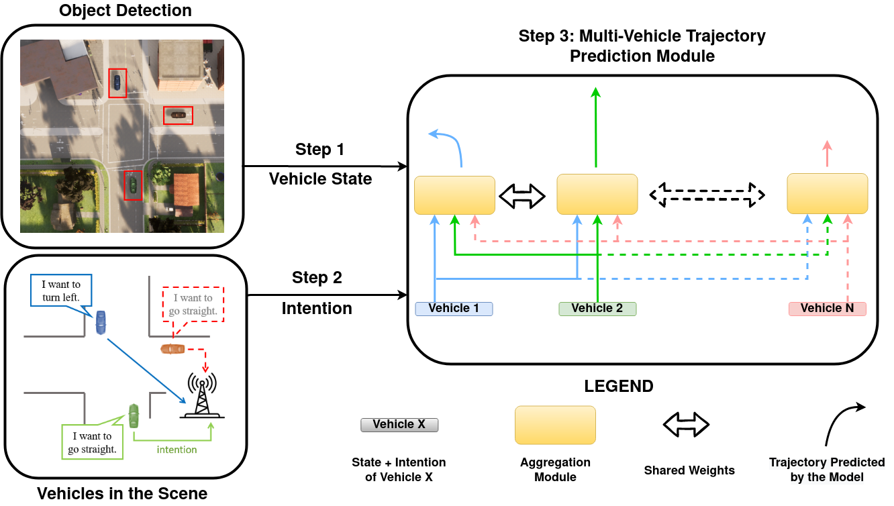
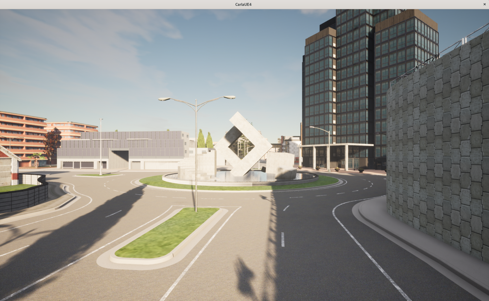
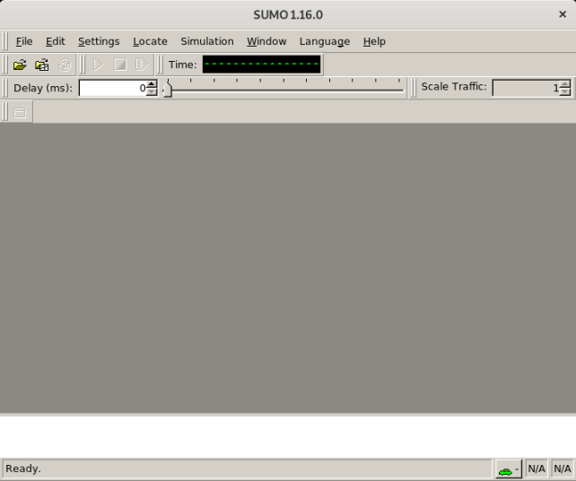
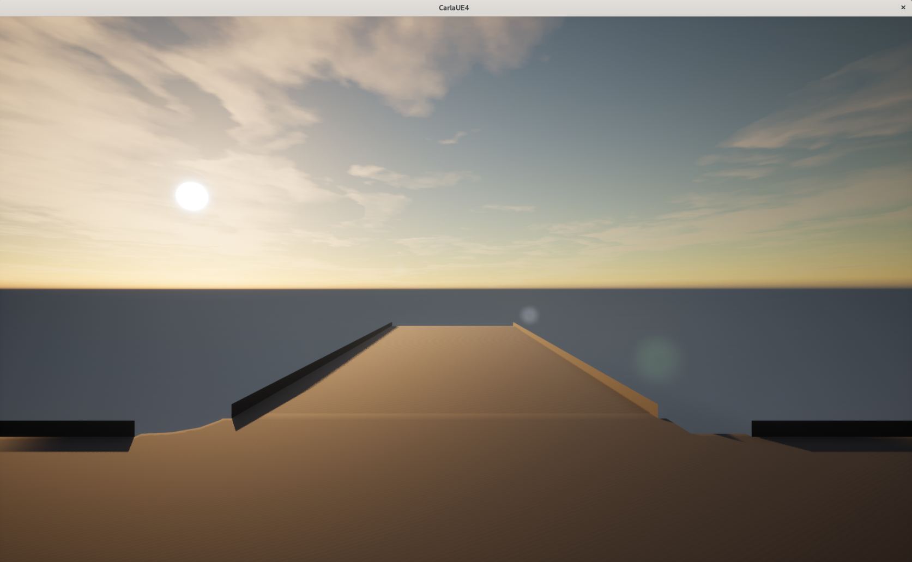
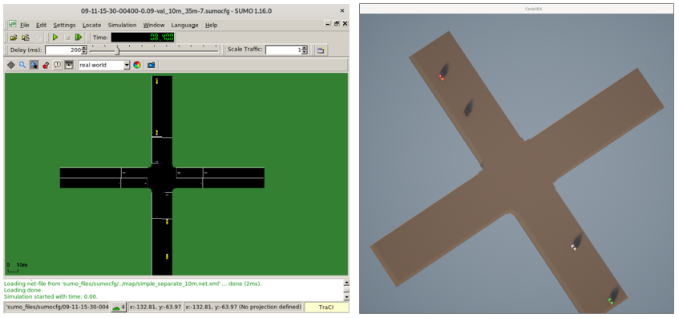

# Multi-Vehicle Trajectory Prediction at Intersections using State and Intention Information

## Abstract
Traditional approaches to prediction of future trajectory of road agents rely on knowing information about their past trajectory. This work rather relies only on having knowledge of the current state and intended direction to make predictions for multiple vehicles at intersections. Furthermore, message passing of this information between the vehicles provides each one of them a more holistic overview of the environment allowing for a more informed prediction. This is done by training a neural network which takes the state and intent of the multiple vehicles to predict their future trajectory.  Using the intention as an input allows our approach to be extended to additionally control the multiple vehicles to drive towards desired paths. Experimental results demonstrate the robustness of our approach both in terms of trajectory prediction and vehicle control at intersections.



## Results
* Controlling vehicles without message passing (baseline) [[video]](https://drive.google.com/file/d/1AdF94g7Gd6ytB8gMKFR0qGHDBQH6qtnC/view?usp=share_link)
* Controlling vehicles with message passing. [[video]](https://drive.google.com/file/d/1V74KRbbgGNnIJ3vWwqs3vQ9wO5Y01D2S/view?usp=share_link)

## Setup

### 1) Packages Install
First you need to create a new environment and install some packages by running the following commands:

``` bash
conda create -n mvn python=3.7
conda activate mvn
conda install pytorch==1.11.0 torchvision==0.12.0 torchaudio==0.11.0 cudatoolkit=11.3 -c pytorch
conda install pyg -c pyg
conda install matplotlib
conda install -c conda-forge cvxpy
conda install -c anaconda lxml
conda install -c anaconda pandas
```

### 2) Software Install
This research project is based on the SUMO-CARLA co-simulation, so you need to install these two traffic simulation software on your machine. More information about this co-simulation setup is available [here](https://carla.readthedocs.io/en/latest/adv_sumo/).
* CARLA: 0.9.10 [[download](https://github.com/carla-simulator/carla/releases/tag/0.9.10/)] [[documentation](https://carla.readthedocs.io/en/latest/download/)]
* SUMO: 1.13.0 [[install](https://sumo.dlr.de/docs/Installing/index.html)]

Alternatively, you could install SUMO by running:
```bash
pip install eclipse-sumo
```
After that, you could check if the installation is successful. For CARLA, you could run:
```bash
cd ${Carla_folder}
# Navigate to the CARLA folder, e.g. cd /home/stud/zhud/Downloads/CARLA_0.9.10

bash CarlaUE4.sh    # Linux
# If you use Windows, execute CarlaUE4.exe
```
Then you should be able to see a city scenario shown in CARLA, as depicted in the following image. 


As for SUMO, after running
```bash
sumo-gui
```
in the terminal, you should be able to see a empty window of SUMO, as depicted in the following image.


## Run the Inference code

### 1) Put the inference code and the map in place

The code in this project is partially developed on top of the official code of CARLA-SUMO co-simulation, thus some official scripts need to be replaced by the files in this repository.

First navigate to the directory where Carla installed, then copy the directories and the scripts in this repository and put them in the correct place as the following image shows. 


*<font color=red>Red</font>: the scripts that we develop based on the official CARLA code, they need to be replaced by the scripts provided in this repository*

*<font color=green>Green</font>: new created scripts or directories*

*<font color=blue>Blue</font>: the original scripts or directories in Carla folder that doesn't need to be replaced*


### 2) Activate our map in CARLA

In this project, we create an intersection scenario. The 3D map of this scenario can be activated by: 
```bash
conda activate mvn

cd ${Carla_folder}/PythonAPI/util   # e.g. cd /home/stud/zhud/Downloads/CARLA_0.9.10/PythonAPI/util

python config.py -x ../../Co-Simulation/Sumo/sumo_files/map/map_15m.xodr
```
Now the intersection scenario should be already activated, as depicted in the following image. You can use the mouse and "W", "A", "S", "D" as arrow keys to change your view perspective.
 

### 3) Run the inference code
First we need to set the environment variable `SUMO_HOME` properly, which should be the location of SUMO installation. If you installed SUMO from pip, you can get the location by running:
```bash
pip show eclipse-sumo
# On our machine, this path is: /usr/stud/zhud/miniconda3/envs/mvn/lib/python3.7/site-packages/sumo
```
Then set `SUMO_HOME` by:
```bash
export SUMO_HOME=${SUMO location}
# e.g. export SUMO_HOME=/usr/stud/zhud/miniconda3/envs/mvn/lib/python3.7/site-packages/sumo
```
Note: if you meet the problem of loading `traci` module (e.g. ImportError: No module named traci), you should check if `SUMO_HOME` path is set properly.

If the above steps all work properly, we can finally run the inference code to control the vehicles at this intersection! Just run the following commands:
```bash
cd ${Carla_folder}/Co-Simulation/Sumo   
# e.g. cd /home/stud/zhud/Downloads/CARLA_0.9.10/Co-Simulation/Sumo

python run_synchronization.py  ${SUMO_config_file}  --tls-manager carla  --sumo-gui  --step-length ${step_length} --pretrained-weights ${path_to_pretrained_weights}

# e.g. python run_synchronization.py  sumo_files/sumocfg/09-11-15-30-00400-0.09-val_10m_35m-7.sumocfg  --tls-manager carla  --sumo-gui  --step-length 0.1  --pretrained-weights  trained_params_archive/sumo_with_mpc_online_control/model_rot_gnn_mtl_wp_sumo_0911_e3_1910.pth
```
Now you should be able to see some vehicles appear and start moving, and the scenarios in SUMO and CARLA should be synchronized, as depicted in the following image (left: SUMO, right: CARLA).


## Training
In this repository, we also release the code for generating data from the SUMO simulator and training the model on your own. 
### 1) Generate the dataset from SUMO
First, you can use `generate_csv.py` provided in this repository to generate the training set and validation set from SUMO by running:
```bash
cd ${folder of this repository} 
# e.g. cd /home/stud/zhud/Multi_Agent_Intersection

python generate_csv.py --num_seconds ${length of the generated sequence (unit: second)} --split ${train or val}
# e.g. python generate_csv.py --num_seconds 1000 --split train
```
The data (.csv format) will be generated in `csv` folder.

Note: the SUMO map used in the above execution is `sumo/map/simple_separate_10m.net.xml`. In case you want to design a new map, you can use `netedit` by running:
```bash
netedit     # or execute netedit.exe on Windows
```

### 2) Preprocess the data
In this project, we use MPC to augment the training set, which aims to improve the robustness of vehicle when it deviate from the center of the lane. 
The script `preprocess.py` is provided in this repository.
Please run the following command in the terminal:
```bash
cd ${folder of this repository} 
# e.g. cd /home/stud/zhud/Multi_Agent_Intersection

python preprocess.py --csv_folder ${csv folder} --pkl_folder ${pkl folder} --num_mpc_aug ${number of MPC data augmentation}

# e.g. python preprocess.py --csv_folder csv/train --pkl_folder csv/train_pre --num_mpc_aug 2

# Note: in case you don't want to have MPC data augmentation, set num_mpc_aug to 0,
# e.g. python preprocess.py --csv_folder csv/train --pkl_folder csv/train_pre --num_mpc_aug 0
```
Now the preprocessed data (*.pkl) is available in `pkl folder` folder.

### 3) Train the model
Once the training set and validation set are obtained, you can begin to train your model by running:
```bash
python train_gnn.py --train_folder ${path to the training set} --val_folder ${path to the validation set} --epoch ${number of total training epochs} --exp_id ${experiment ID} --batch_size ${batch size}

# e.g. python train_gnn.py --train_folder csv/train_pre --val_folder csv/train_pre --epoch 20 --exp_id sumo_0402 --batch_size 20
```
Once the training process is finished, you can find the trained weights in `trained_params/${exp_id}` folder. 

### 4) Run the inference on CARLA-SUMO co-simulation
If the above steps all work properly, now you can use the weights trained on your own to control the vehicles at the intersection as we showed you before.

```bash
cd ${Carla_folder}/Co-Simulation/Sumo   
# e.g. cd /home/stud/zhud/Downloads/CARLA_0.9.10/Co-Simulation/Sumo

python run_synchronization.py  ${SUMO_config_file}  --tls-manager carla  --sumo-gui  --step-length ${step_length} --pretrained-weights ${path_to_pretrained_weights}

# e.g. python run_synchronization.py  sumo_files/sumocfg/09-11-15-30-00400-0.09-val_10m_35m-7.sumocfg  --tls-manager carla  --sumo-gui  --step-length 0.1  --pretrained-weights /home/stud/zhud/Multi_Agent_Intersection/trained_params/sumo_0402/model_gnn_wp_sumo_0402_e3_0010.pth
```

## Reference
The code of the MPC module in this repository is modified from the code developed by Huiming Zhou et al. in the GitHub repository: https://github.com/zhm-real/MotionPlanning.
